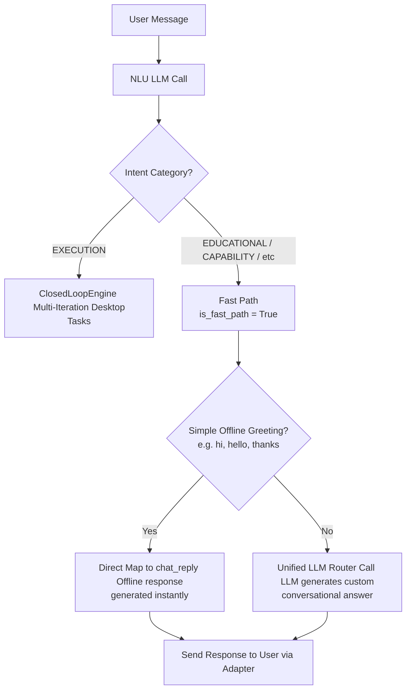

# Implementation Plan — Fix Conversational Flows and Ollama Integration Stability

This plan addresses several key issues reported in the user remark log (`remark.md`) that affect the stability, reliability, and accuracy of conversational responses and tool integrations:

1. **Conversational Loops & Third-Person Summaries**: Currently, all messages (including simple greetings and general questions like "Hi", "What is your name") are routed through the multi-iteration `ClosedLoopEngine` instead of bypassing it. This leads to the LLM returning a third-person completion summary (e.g., `"Greeting user warmly as part of initial interaction."`) which is mistakenly delivered to the user as the actual chat reply.
2. **Offline/Direct-map Greetings**: Greetings should bypass LLM processing and run offline via `chat_reply`'s built-in heuristics, but other questions (e.g., "What is your name") should call the Unified LLM for a natural response.
3. **Ollama Embedding 404 Error**: The `SemanticEncoder` makes a POST request to `/api/embeddings`, which is deprecated and returns `404 Not Found` on newer Ollama versions, causing fallback to keyword embeddings.
4. **Ollama Timeout Hangs**: When Ollama hangs or faces a read timeout (60 seconds), `LocalLLM` retries 3 times, hanging the system for up to 3 minutes before letting the router fall back to another backend.

---

## Detailed Design: How Categories and Fast-Paths are Recognized

### 1. How `is_conversational` is mapped (LLM-based NLU)
The category is **not** hardcoded based on raw strings. Instead, it is dynamically recognized by the LLM during the initial NLU (Natural Language Understanding) step:
1. **NLU Parse Step**: Every input goes to `NLU.parse()` which makes an LLM call using the `nlu` system instructions.
2. **Classification**: The LLM classifies the user's input and returns a structured JSON containing the `intent_category` (e.g., `EDUCATIONAL`, `EXECUTION`, `CAPABILITY`, `HYPOTHETICAL`).
   - For `"hi"`, the LLM returns `intent_category: "EDUCATIONAL"` and `intent: "chat_reply"`.
   - For `"what is your name"`, it also returns `intent_category: "EDUCATIONAL"` and `intent: "chat_reply"`.
   - For `"open calculator"`, it returns `intent_category: "EXECUTION"` and `intent: "open_app"`.
3. **Mapping inside Orchestrator**: The orchestrator checks the NLU's decision:
   ```python
   is_conversational = not packet.compound and packet.intent_category in ("EDUCATIONAL", "HYPOTHETICAL", "CAPABILITY", "TEXT_ANALYSIS")
   ```
   If the NLU classified the input as one of these conversational categories, `is_conversational` becomes `True` (which sets `is_fast_path = True`).

---

### 2. The Multi-Step Planning & Chat Flow
After the NLU step determines that the message is conversational, the system decides whether a second LLM call is needed:



* **Simple Greetings (e.g., "hi", "hello", "thanks")**:
  - Bypasses the second LLM call completely to save time/tokens.
  - Matches the `is_simple_greeting` check in the planner, yielding an offline response (e.g., "Hello! How can I help you today?").
* **Complex Questions (e.g., "what is your name")**:
  - Requires custom answers, so it makes a second LLM call (via the Unified Router).
  - The LLM generates the response, which is then mapped to `chat_reply` and delivered immediately without running the ClosedLoopReAct loop.

---

## Proposed Changes

### Brain & Planner Components

#### [MODIFY] [orchestrator.py](file:///f:/RunningProjects/JarvisControlSystem/jarvis/brain/orchestrator.py)
* Restore the `is_fast_path` detection logic to identify conversational, safe_mode, and simple chat replies. This prevents them from entering the Closed-Loop ReAct Engine.
* In the `is_fast_path` branch, if running asynchronously (`async_run=True`), ensure the resulting `SkillResult`s are formatted and sent back to the user via the `adapter`.

#### [MODIFY] [planner.py](file:///f:/RunningProjects/JarvisControlSystem/jarvis/brain/planner.py)
* Refine the Direct Map bypass check for `chat_reply` to only map simple greetings/acknowledgments (e.g., "hello", "hi", "thanks", "ok") directly. Other complex conversational queries (e.g., "What is your name") will fall through to the LLM Unified Router to generate natural responses.

---

### Memory & LLM Integration Components

#### [MODIFY] [semantic_encoder.py](file:///f:/RunningProjects/JarvisControlSystem/jarvis/memory/semantic_encoder.py)
* Update the Ollama API endpoint from the deprecated `/api/embeddings` to `/api/embed`.
* Adjust the request payload parameters from `"prompt"` to `"input"` as required by the `/api/embed` endpoint.

#### [MODIFY] [local_llm.py](file:///f:/RunningProjects/JarvisControlSystem/jarvis/llm/backends/local_llm.py)
* In both `decide` and `_call_llm_closed_loop`, intercept `requests.exceptions.Timeout` and `requests.exceptions.ConnectionError`.
* If a timeout or connection failure occurs, fail immediately and return `None` (rather than retrying 3 times) to trigger immediate routing to fallback backends.

---

## Verification Plan

### Automated Tests
* We will run the unit tests for NLU and local LLM backends to verify that the router, planner, and NLU still work correctly.
  - `pytest tests/unit/test_loopholes_regression.py`
  - `pytest tests/unit/test_closed_loop.py` (if present)

### Manual Verification
* Start the Jarvis gateway via `jarvis.bat gateway start` or a test script.
* Test sending the following utterances to verify correct and fast responses:
  1. `"hi"` or `"hello"` (should return instantly with an offline greeting response: "Hello! How can I help you today?").
  2. `"what is your name"` (should call the LLM and return a natural chat response instead of a third-person summary).
  3. Verify that the Ollama embedding warmup no longer throws a `404 Not Found` error.
