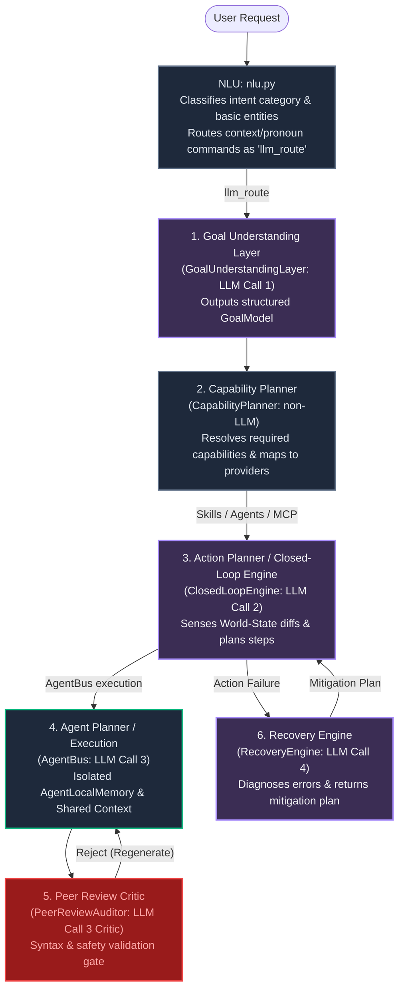

# Implementation Plan: Multi-LLM Routing, Agent Orchestration & NLU Decoupling

This design and implementation plan establishes a clean, production-grade decoupling of the user understanding, action planning, execution, and safety critic layers in the **Jarvis Control System**. It details how to split roles between initial NLU and cognitive planning, configure task-specific LLM routing, and execute agents inside isolated memory containers with peer review.

---

## 1. Architectural Strategy: The Decoupled Multi-LLM Cognitive Loop

Rather than using a single model or overloading the initial Natural Language Understanding (NLU) interface with planning and routing logic, Jarvis operates on a **five-stage cognitive loop**. Each stage performs a dedicated cognitive task and can be routed to a specific LLM model (e.g., using lightweight, fast models for understanding, and smart models for execution planning and code auditing).



---

## 2. Allocation of LLM Responsibilities & Task-Specific Routing

The system routes specific cognitive tasks to distinct model endpoints configured in `config.yaml` to optimize latency and VRAM/token costs:

| Architectural Phase | Core Component | LLM Involvement | Model Type Recommendation | Responsibility |
| :--- | :--- | :--- | :--- | :--- |
| **User Understanding (NLU)** | `NLU.parse()` | **Optional/Yes** | Fast / Lightweight (`qwen3.5:2b` or `gemma3:1b`) | Classifies intent category; flags context-dependent or relative utterances as `llm_route` without building execution plans. |
| **Goal Extraction** | `GoalUnderstandingLayer.understand()` | **Yes (LLM Call 1)** | Fast / Structured (`qwen3.5:2b` or `gemma3:1b`) | Translates user query + app context into structured `GoalModel` (primary goals, abstract intents, constraints, knowledge requirements). |
| **Action Planning** | `ClosedLoopEngine.run()` | **Yes (LLM Call 2)** | Smart / Reasoning (`qwen3.5-coder` or `gpt-4o-mini`) | Closed-loop OODA planner. Analyzes pre/post execution `WorldState` differentials to plan the next actions or conclude. |
| **Agent execution** | `AgentBus.run_single()` | **Yes (LLM Call 3)** | Domain-Specialized (`qwen-coder` / `gpt-4o`) | Executes code-synthesis, filesystem manipulation, or search loops inside `AgentLocalMemory`. |
| **Multi-Agent Critic** | `PeerReviewAuditor.audit()` | **Yes (LLM Call 3 Critic)** | Smart / Safety-aligned (`gpt-4o` or local critic) | Audits generated code, scripts, or execution steps for syntax and safety rules prior to running on the host OS. |
| **Self-Healing** | `RecoveryEngine.diagnose_and_heal()` | **Yes (LLM Call 4)** | Fast / Logic-oriented (`qwen3.5:2b`) | Interprets execution exceptions/timeouts and generates bypass, scroll, or window-refocus steps. |

---

## User Review Required

> [!IMPORTANT]
> **Sub-Agent Execution Boundary & Memory Isolation:**
> Each sub-agent spun up by the `AgentBus` runs inside its own execution containment container:
> - It is initialized with its own private local memory context (`AgentLocalMemory`) and specific prompt injections/system instructions.
> - The sub-agent's internal reasoning loop, command retry history, and local scratchpad files are kept entirely isolated from the main orchestrator.
> - Upon completion, **only a concise semantic summary** of the final action result is passed back to the main agent's planning loop. This protects the main planner's token space and prevents context pollution.
> 
> **Graceful Task-Specific Routing Fallback:**
> If a task-specific model routing configuration is missing or invalid in `config.yaml`, the system **will fall back to the primary model** (`llm.primary`). This guarantees robustness while allowing simple config files.
> 
> **NIM and Remote Critic Templates:**
> We are adding placeholder configurations for remote Critic/NIM models in `config.yaml` which can be populated with API keys later.

> [!NOTE]
> All existing reliability fixes (Verification Policy Separation, Closed-Loop repetition limits, and automated regression test covers TEST-030 to TEST-035) are preserved and remain in scope.

---

## Proposed Changes

### Component 1: Config & LLM Routing

#### [MODIFY] [config.yaml](file:///f:/RunningProjects/JarvisControlSystem/jarvis/config/config.yaml)
- Define a unified model routing dictionary under `llm.routing`:
  ```yaml
  llm:
    primary: local
    fallback: local
    emergency_fallback: mock
    
    # Task-Specific Routing
    routing:
      nlu: local              # Use local Ollama qwen3.5:2b
      goal_understanding: local
      action_planning: local  # Can be mapped to 'nvidia' or 'openai' in production
      agent_execution: local
      peer_review: local
      recovery: local
  ```
- Add placeholder configurations for Critic and NVIDIA NIM integrations.
- Change default local model backend parameters to use `qwen3.5:2b` as cached and disable `auto_pull` to avoid runtime timeouts.

#### [MODIFY] [llm_router.py](file:///f:/RunningProjects/JarvisControlSystem/jarvis/llm/llm_router.py)
- Refactor `LLMRouter` to support task-specific routing:
  - Add task-specific routing mapping loaded from `config.yaml`.
  - Introduce methods:
    - `route_for_task(task_name: str, prompt: str, context: str = "")`
    - `decide_for_task(task_name: str, prompt: str, context: str = "")`
  - In `route_for_task` / `decide_for_task`, inspect `llm.routing` for the given task. If found, route the request using that specific backend configuration.
  - **FALLBACK**: If the task configuration is missing from `llm.routing`, fall back to the configured primary LLM interface to ensure smooth backwards compatibility.

---

### Component 2: NLU & Goal Understanding Layers

#### [MODIFY] [nlu.py](file:///f:/RunningProjects/JarvisControlSystem/jarvis/perception/nlu.py)
- Update NLU rules to prevent planning:
  - Ensure NLU does not build tool plans. It parses simple commands directly (e.g., `open_app`), and routes all complex, multi-step, pronoun-heavy, or context-relative commands to `intent="llm_route"`.
  - Pass the configuration-driven task `nlu` to the router when executing the LLM call.

#### [MODIFY] [goal_understanding.py](file:///f:/RunningProjects/JarvisControlSystem/jarvis/perception/goal_understanding.py)
- Update `GoalUnderstandingLayer.understand` to dispatch its LLM call via `self._router.decide_for_task("goal_understanding", prompt, context)`, guaranteeing the goal understanding task uses its dedicated model.

---

### Component 3: Planning & Agent Orchestration

#### [MODIFY] [closed_loop_engine.py](file:///f:/RunningProjects/JarvisControlSystem/jarvis/brain/closed_loop_engine.py)
- Update `ClosedLoopEngine` thinking process:
  - Dispatch planning calls (THINK) using `self._router.decide_for_task("action_planning", prompt, context)`.
  - Refactor loop detection logic (reduce repetition limit to `> 2` as planned).
  - Integrate verification loop policies to trust successful generic UI mutations when state hashes are unchanged.

#### [MODIFY] [agent_bus.py](file:///f:/RunningProjects/JarvisControlSystem/jarvis/agents/agent_bus.py)
- Refactor `AgentBus.run_single` to route local agent runs using the `agent_execution` model backend configuration.
- Enforce the **Sub-Agent Isolation Boundary**:
  - The sub-agent runs with its private `AgentLocalMemory` context.
  - Once the sub-agent returns the execution result, compile a clean, high-level summary of the outcome (via `AgentResult.output`).
  - Send **only the result output summary** back to the main agent's planner via `SharedAgentContext` observations or execution logging, discard intermediate local steps from the main prompt context.
- Wire the task-specific `peer_review` model configuration to the `PeerReviewAuditor`.

#### [MODIFY] [peer_review.py](file:///f:/RunningProjects/JarvisControlSystem/jarvis/agents/peer_review.py)
- Update `PeerReviewAuditor.audit` to execute its safety evaluation using the dedicated `peer_review` LLM router task endpoint.

#### [MODIFY] [recovery_engine.py](file:///f:/RunningProjects/JarvisControlSystem/jarvis/brain/recovery_engine.py) (or new file if needed)
- Ensure diagnostics and healing plans are resolved using the dedicated `recovery` LLM task routing.

---

### Component 4: Testing & Verification

#### [MODIFY] [test_pipeline.py](file:///f:/RunningProjects/JarvisControlSystem/tests/unit/test_pipeline.py)
- Update unit tests to match configuration-driven mock setups.

#### [NEW] [test_reports_regression.py](file:///f:/RunningProjects/JarvisControlSystem/tests/unit/test_reports_regression.py)
- Add automated regression tests covering tests `TEST-030` through `TEST-035`.

#### [NEW] [test_multi_llm_routing.py](file:///f:/RunningProjects/JarvisControlSystem/tests/unit/test_multi_llm_routing.py)
- Test task-specific LLM routing configuration and route mapping:
  - Mock different backends (e.g. `mock_nlu`, `mock_planner`).
  - Assert that calling `understand` triggers the NLU model, while calling `ClosedLoopEngine.run` triggers the planner model.
  - Assert that missing task-specific routing falls back to the configured primary model interface.

---

## Verification Plan

### Automated Tests
- Execute the regression and unit tests:
  ```powershell
  python -m pytest tests/
  ```
- Run specific tests for multi-LLM routing:
  ```powershell
  pytest tests/unit/test_multi_llm_routing.py
  ```

### Manual Verification
- Run a live command and check `logs/runtime/llm_raw.log`.
- Verify that different backends are logged for `PLAN`, `DECIDE`, `NLU`, and `PEER_REVIEW` stages based on the config configurations.
