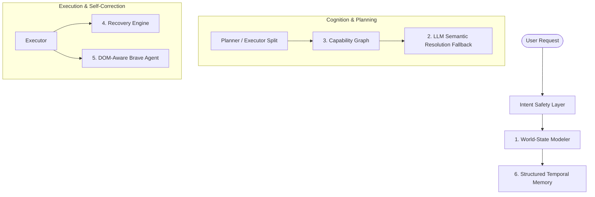

# Implementation Plan: Autonomous Operating System Cognition Layer

This updated plan outlines the roadmap for resolving the **BIGGEST REMAINING PROBLEMS** in Jarvis to transform it into a fully autonomous, dynamic computer use system (comparable to Claude Computer Use or OpenAI Operator), as described in [remark.md](file:///f:/RunningProjects/JarvisControlSystem/logs/remark.md).

---

## Biggest Remaining Problems & Solutions

### 1. Real World-State Modeling (Lack of Semantic Environment Models)
* **Problem:** Currently, UI state is captured as isolated hashes. Jarvis does not understand the *structural meaning* of the operating system environment.
* **Solution:** Implement a **Unified World-State Modeler** (`WorldStateModeler`).
  - Represent the PC as a set of structured entities: active windows, background processes, system resource levels, connected networks, filesystems, and browser states.
  - Expose a clean, structured JSON state graph to the LLM planner and OODA loop for semantic reasoning.

### 2. Fuzzy Matching Failure (LLM Semantic Resolution Fallback)
* **Problem:** Syntactic fuzzy string matching (like `fuzzywuzzy`) will eventually fail when users refer to windows by description rather than label (e.g. "Focus my coding environment" for VS Code).
* **Solution:** Introduce **LLM Semantic Resolution Fallback**.
  - If standard fuzzy matching confidence falls below `75%`, invoke the Semantic Encoder (to calculate cosine similarities of embeddings) or query the local/cloud LLM to match the user's intent to one of the open process names or window titles.

### 3. Capability Graph (No Dynamic Skill Mapping)
* **Problem:** Action paths are planned linearly. Jarvis cannot autonomously discover how skills depend on or chain into one another.
* **Solution:** Create a **CapabilityGraph** (Skill Dependency Network).
  - Map skills as nodes and dependencies as edges (e.g., `click_web_element` requires an active browser context established by `open_brave_profile`).
  - The Planner can run topological sorts or graph pathfinding to dynamically assemble multi-step pipelines without pre-baked static rules.

### 4. Recovery Engine (No Diagnostics & Failure Categorization)
* **Problem:** Recovery is limited to basic retries. Jarvis does not diagnose *why* an action failed.
* **Solution:** Build a dedicated **Dynamic Recovery Engine** (`RecoveryEngine`).
  - Classify runtime errors into specific categories: `UIA_ELEMENT_NOT_FOUND`, `WINDOW_CLOSED_UNEXPECTEDLY`, `MOUSE_FAILSAFE_TRIGGERED`, `SELECTOR_TIMEOUT`.
  - Apply custom mitigation plans:
    - *Mouse fail-safe?* Recenter the pointer and shift to UIA clicks.
    - *Window closed?* Re-open and restore background state.
    - *Element hidden?* Issue scroll actions or consult the vision fallback.

### 5. Weak Browser Cognition (No DOM Interaction Tree)
* **Problem:** Treating web pages as coordinates or plain selectors is extremely brittle.
* **Solution:** Evolve the Brave Agent with an **Interactive DOM Accessibility Tree**.
  - Playwright/CDP will extract and compile a compact, text-based interactive accessibility tree of the active web page, mapping clickable nodes to unique integer indices:
    `[1] Link "Sign In" | [2] Input "search_query" | [3] Button "Search"`
  - Inject this compact DOM representation into the Brave Agent, allowing it to issue highly precise actions like `click(1)` or `fill(2, 'python guides')`.

### 6. Structured Temporal Memory (No Episodic Timeline Logs)
* **Problem:** Jarvis does not know *when* actions occurred or *how* the operating environment evolved over time.
* **Solution:** Build a **Structured Temporal Memory** (Episodic Timeline).
  - Persist chronological event records in the SQLite graph database tracking exact timestamps, state changes, action latency, and success metrics.
  - This allows Jarvis to resolve temporal queries (e.g., "What was I doing 10 minutes ago?" or "Did I close Notepad recently?").

---

## Proposed Changes



### 1. Unified World-State Modeler
#### [NEW] [world_state.py](file:///f:/RunningProjects/JarvisControlSystem/jarvis/brain/world_state.py)
* Define a unified `WorldState` class that aggregates:
  - `active_window`: Process name, window title, handle (hwnd), dimensions.
  - `running_processes`: A filtered list of running process names using `psutil`.
  - `system_resources`: CPU, RAM, and network active adapters.
  - `active_browser`: Open Brave/Chrome profiles, active tab title, active tab URL.
* Modeler method `get_current_state()` compiles this unified dictionary into a clean, compact, LLM-injectable format.

---

### 2. LLM Semantic Resolution Fallback
#### [MODIFY] [state_manager.py](file:///f:/RunningProjects/JarvisControlSystem/jarvis/brain/state_manager.py)
* Integrate `SemanticEncoder` and LLM router fallbacks:
  - If fuzzy string matching for a window lookup has a score `< 75%`, calculate the cosine similarity between the command embedding and the active window titles in the `WorldState`.
  - Fall back to a fast LLM classification prompt to select the matching window handle from the current active process list.

---

### 3. Capability Graph
#### [NEW] [capability_graph.py](file:///f:/RunningProjects/JarvisControlSystem/jarvis/skills/capability_graph.py)
* Implement `CapabilityGraph` mapping every skill and its required pre-conditions (e.g., `open_app` sets up foreground app context; `click_web_element` requires browser active).
* The planner will query the Capability Graph to automatically chain skills for complex, multi-layered tasks.

---

### 4. Dynamic Recovery Engine
#### [NEW] [recovery_engine.py](file:///f:/RunningProjects/JarvisControlSystem/jarvis/brain/recovery_engine.py)
* Implement `RecoveryEngine` containing structured failure mitigations:
  - Intercepts exceptions raised during skill calls (e.g., PyAutoGUI fail-safe triggers, element hidden, UIA timeout).
  - Dynamically switches to UIA clicks, scrolls the element into view, or restores the window prior to retrying.

---

### 5. Advanced DOM-Based Browser Cognition
#### [MODIFY] [browser_skill.py](file:///f:/RunningProjects/JarvisControlSystem/jarvis/skills/builtins/browser_skill.py)
* Implement an accessibility tree extractor using Playwright's `page.locator` or CDP accessibility tree node queries.
* Produce a clean, structured, and index-based tree representing only interactive elements (buttons, inputs, links).
* Add a `click_node(index)` and `fill_node(index, text)` skill using the generated indices.

---

### 6. Structured Temporal Memory
#### [NEW] [temporal_memory.py](file:///f:/RunningProjects/JarvisControlSystem/jarvis/memory/layers/temporal.py)
* Implement a timeline logger in the SQLite database storing:
  - `timestamp`: ISO-8601 string.
  - `app_context`: Active application.
  - `action`: Skill name and target.
  - `status`: SUCCESS | FAILED.
  - `duration_ms`: Execution latency.
* Expose `get_timeline(since)` to let the LLM search recent historical activities.

---

## Verification Plan

### Automated Tests
* We will write specific tests for the new cognition layers:
  ```powershell
  # Test dynamic world state compilation
  pytest tests/unit/test_world_state.py
  # Test interactive DOM tree index generation
  pytest tests/unit/test_dom_cognition.py
  # Test temporal timeline logging
  pytest tests/unit/test_temporal_memory.py
  ```

### Manual Verification
1. **Semantic Resolution:** Open a text editor (Notepad). Say "Focus my writing area"; verify the LLM semantic resolution matches it to `notepad.exe` and sets focus correctly.
2. **DOM Clicking:** Navigate to a login page; verify the interactive tree is printed with indices (e.g., `[1] Input 'Username' | [2] Button 'Sign In'`) and Jarvis is able to execute a login using precise index clicks.
3. **Temporal Retrieval:** Ask "What was I working on a few minutes ago?"; verify Jarvis queries the temporal timeline and returns a clear summary.
