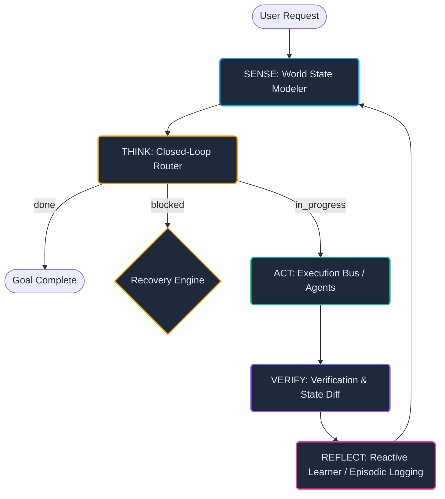
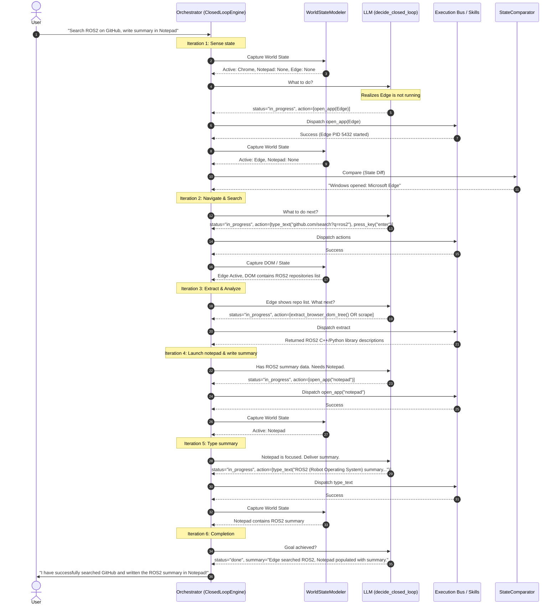

# Architectural Blueprint: True Autonomous Agent Orchestration in Jarvis v2

This document provides a highly detailed architectural analysis and design blueprint evaluating how a truly autonomous, self-healing, and state-aware AI agent system should plan tasks, communicate between components, and manage execution flow.

It maps state-of-the-art agentic design theories (OODA, ReAct, Multi-Agent Networks) directly to your existing implementation in the [Jarvis Control System](file:///f:/RunningProjects/JarvisControlSystem/).

---

## 1. The Autonomous Execution Cycle (Observe → Plan → Act → Verify → Reflect)

Traditional software executes hardcoded, deterministic steps. In contrast, a true autonomous agent operates within a continuous, state-aware **feedback loop**. Your system's [ClosedLoopEngine](file:///f:/RunningProjects/JarvisControlSystem/jarvis/brain/closed_loop_engine.py) implements this beautifully via a System-to-LLM execution loop.



### Stage-by-Stage Breakdown in Jarvis

#### 1. SENSE (Observation & Perception)
Before taking any action, the agent must build a high-fidelity semantic model of its environment. Your [WorldStateModeler](file:///f:/RunningProjects/JarvisControlSystem/jarvis/brain/world_state.py#L133) achieves this on Windows by capturing:
*   **Foreground Context**: The active application and window titles via `win32gui.GetForegroundWindow()`.
*   **Desktop Topography**: Open application windows and potential modal child dialogs via pywinauto's `Desktop` tree enumeration.
*   **System Telemetry**: CPU and RAM load percentages via `psutil`.
*   **Browser Metadata**: Active tab titles, profiles, and URLs.

#### 2. THINK (Task Planning & Dynamic Routing)
Instead of hardcoding a sequence, the goal is evaluated against the current environment.
*   The [ClosedLoopPrompt](file:///f:/RunningProjects/JarvisControlSystem/jarvis/brain/closed_loop_prompt.py) structures the system context.
*   The agent is fed the **Execution History** (storing successful/failed steps so it never loops infinitely) and the **Current World State**.
*   The LLM issues a [ClosedLoopDecision](file:///f:/RunningProjects/JarvisControlSystem/jarvis/llm/llm_interface.py) in structured JSON, signaling its status as:
    *   `done`: Terminates execution and provides a final user summary.
    *   `in_progress`: Dispatches a list of immediate skill calls or agent handoffs.
    *   `blocked`: Halts and requests user input or initiates self-healing.

#### 3. ACT (Tool & Skill Dispatch)
Actions are translated into `SkillCalls` and executed. Jarvis categorizes action modes:
*   **Direct Skills**: OS, window, keyboard, and browser manipulation.
*   **MCP Tools**: File reading/writing, web searches, etc.
*   **Autonomous Agents**: Delegation of long-running, multi-step tasks.

#### 4. VERIFY (Outcome Verification)
An action is not complete until its effects are measured. Jarvis uses a two-phase check:
*   **State Differential**: It re-samples the world state immediately after execution and computes a `WorldState.diff()` (e.g., *focused window changed from 'Notepad' to 'Brave'*).
*   **Verification Loop**: Compares the measured diff against the expected outcomes to confirm if an execution succeeded.

#### 5. REFLECT (Memory Integration & Macro Learning)
If the plan succeeded, the system's `ReactiveLearner` and `EpisodicMemory` record the state transition. In Jarvis, successful multi-step sequences that prove reliable are automatically learned as state-aware **Macros** (reflexes) to bypass the slow cognitive LLM paths in future attempts.

---

## 2. Multi-Agent Systems: Orchestrator & Specialized Sub-Agents

For complex, heterogeneous tasks, a single monolithic agent is fragile. An elegant, modular architecture utilizes a **Main Orchestrator** acting as the central nervous system, routing requests to highly specialized **Sub-Agents**.

Your [AgentBus](file:///f:/RunningProjects/JarvisControlSystem/jarvis/agents/agent_bus.py) and [TaskGraph](file:///f:/RunningProjects/JarvisControlSystem/jarvis/agents/task_graph.py) are perfectly positioned to manage this multi-agent choreography:

```
                  ┌───────────────────────┐
                  │   Main Orchestrator   │
                  │ (ClosedLoopEngine)    │
                  └──────────┬────────────┘
                             │
                  ┌──────────▼────────────┐
                  │       AgentBus        │
                  └──────────┬────────────┘
                             │
     ┌───────────────────────┼───────────────────────┐
     ▼                       ▼                       ▼
┌──────────┐            ┌──────────┐            ┌──────────┐
│ Windows  │            │  Coding  │            │ Browser  │
│  Agent   │            │  Agent   │            │  Agent   │
└──────────┘            └──────────┘            └──────────┘
```

### Specialized Agents Directory & Blueprint

The tables below define how each specialized agent in your envisioned architecture should be structured, specifying their focus, standard SENSE inputs, and ACT capability sets:

| Specialized Agent | Core Responsibility | SENSE Inputs (Observations) | ACT Capabilities (Tools) |
| :--- | :--- | :--- | :--- |
| **Windows/Desktop Agent** | OS navigation, window management, app launching, native UI automation. | Open windows tree, process tree, focused Win32 HWND, active child modal window titles. | `open_app`, `close_app`, `type_text`, `press_key`, Win32 API window placement commands. |
| **Coding Agent** | Code review, bug fixing, test suite execution, refactoring, documentation. | Knowledge graph nodes (CRG), imports list, compiler/lint errors, pytest output. | `view_file`, `write_to_file`, `replace_file_content`, `run_command` (make, pytest, linter). |
| **Web/Browser Agent** | Web scraping, form-filling, navigating research materials, search engine queries. | Browser DOM tree, viewport snapshots, active tabs, URL histories. | `navigate_url`, `click_web_element`, `fill_web_element`, `extract_browser_dom_tree`. |
| **Chat/Reasoning Agent** | Answering conceptual questions, text analysis, prompt refinement, educational conversations. | Conversation history, system preferences, memory context, user inputs. | `chat_reply`, `ask_user`, model temperature adjustments. |
| **Command/Terminal Agent** | Running shell scripts, compiling binaries, monitoring environment variables, package management. | Command outputs (stdout/stderr), active background process PIDs, shell exit codes. | `run_command`, `manage_task` (kill, input, status), custom CLI tool wrappers. |
| **File System Agent** | Organizing files, parsing formats, searching paths, directory cleanups. | OS directory layouts, file sizes, extensions, glob patterns. | `list_dir`, `grep_search`, `read_file`, `write_file`, directory creation/deletion. |
| **Vision Agent** | Visual verification of UI state, OCR, parsing complex charts or images. | Desktop screenshot bytes, browser bounding boxes. | OpenCV analyses, Claude/Gemini multimodal image evaluations, OCR text extractions. |
| **Memory Agent** | Vectorizing past experiences, managing state graphs, cleaning short-term caches. | SQLite memory databases, temporal event logs, semantic vectors. | Semantic search, state-aware pathfinding (A*), learned macro writing, pruning dead paths. |

---

## 3. Communication and Data Flow Between Sub-Agents

For an orchestrator to successfully coordinate these agents without hardcoded workflows, it needs standard message-passing and shared-state protocols.

```
       [Orchestrator]
             │
             │ (Generates TaskGraph DAG)
             ▼
       [TaskGraph] ──────────┐ (Topological Sorting)
             │               │
             │               ▼
             │       ┌───────────────┐
             │       │ Stage 1 (Par) │ ──► Runs [Windows Agent] & [Browser Agent]
             │       └───────┬───────┘
             │               │ (Emits results to SharedContext)
             │               ▼
             │       ┌───────────────┐
             │       │ Stage 2 (Seq) │ ──► Runs [Coding Agent]
             │       └───────┬───────┘
             │               │
             ▼               ▼
       [AgentBus] ◄─── [Shared Context]
```

### The Communication Layers in Jarvis

#### 1. Ephemeral Message Passing via AgentBus
When a specialized agent is triggered, the Orchestrator routes it via `agent_bus.run_single(name, task, context)`.
*   The `context` dictionary acts as a pipeline transit board.
*   Your system passes a pipeline results register under the key `__pipeline_results__`, allowing downstream agents to inspect the outputs, exit status, and performance of upstream agents.

#### 2. Shared Memory Context (`SharedAgentContext`)
Autonomous agents must not step on each other's toes when working concurrently.
*   **`AgentLocalMemory`**: Acts as an isolated, ephemeral scratchpad. It logs local agent execution traces (e.g., `local_memory.log_step(...)`) to prevent the agent's prompt from getting cluttered with details from other tasks.
*   **`SharedAgentContext`**: A global thread-safe memory manager wrapper. It enables cross-agent information retrieval and registers semantic observations (e.g., `shared.observe("Agent X compiled codebase successfully")`).

#### 3. Topological Choreography (`TaskGraph`)
When a complex goal is requested (e.g., *"Search for ROS2 on GitHub, write a python example in VSCode, and run it"*), the Orchestrator builds a `TaskGraph` (DAG):
1.  **Stage 1 (Parallel)**: Launch Edge/Browser, query GitHub for ROS2, search for tutorials.
2.  **Stage 2 (Sequential)**: Feed retrieved snippets into the Coding Agent, open Notepad/VSCode, and write a summary.
3.  **Stage 3 (Sequential)**: Terminal/Command Agent executes the script and verifies output.

The [TaskGraph.get_execution_stages()](file:///f:/RunningProjects/JarvisControlSystem/jarvis/agents/task_graph.py#L72) automatically groups these tasks into parallel execution levels using a clean Kahn's topological sort, preventing deadlock states.

---

## 4. Execution Flow, Failures, and Self-Healing Recovery

In real-world environments, failures (failed clicks, network timeouts, invalid shell inputs) are inevitable. True autonomy is defined by how the system recovers.

Your [RecoveryEngine](file:///f:/RunningProjects/JarvisControlSystem/jarvis/brain/recovery_engine.py) combined with the `ClosedLoopEngine` implements a dual-layer self-healing mechanism:

```
[Action Executed] ──► [Fails / Times Out] 
                             │
                             ▼
                 [Self-Healing Evaluation]
                             │
      ┌──────────────────────┴──────────────────────┐
      ▼ (Logical Failure)                           ▼ (UI / OS Failure)
[RecoveryEngine Diagnoses]                  [StateComparator Detects]
      │                                             │
      ▼                                             ▼
Corrective plan generated                  UI context state restored
(e.g., fallback skill used)                 (e.g., refocus window)
      │                                             │
      └──────────────────────┬──────────────────────┘
                             ▼
                  [Action Retried/Healed]
```

### 1. The Reactive Error-Diagnose-Heal Loop (Logical Failures)
If a skill or agent execution encounters an exception or logical block, the `ClosedLoopEngine` captures the error message and forwards it to the [RecoveryEngine](file:///f:/RunningProjects/JarvisControlSystem/jarvis/brain/recovery.py):
1.  **Diagnosis**: The linter, process log, or application exception is parsed.
2.  **Correction Plan**: A compensatory, lightweight sub-plan is generated (e.g., *"If notepad failed to type, check if notepad is minimized; maximize it, refocus, and re-type"*).
3.  **Bypass**: If a specific tool fails (e.g., Brave browser automation), it falls back to a different mechanism (e.g., `curl` via a command line skill, or requesting user feedback).

### 2. State-Aware Healing (UI / OS Failures)
If the desktop environment shifts unexpectedly (e.g., a modal popup blocks a click, or focus shifts away from Notepad), the [StateComparator](file:///f:/RunningProjects/JarvisControlSystem/jarvis/memory/state_comparator.py) uses the World State delta to:
*   Identify that the target window lost active focus.
*   Dispatch an automatic `refocus_window` or `close_modal` skill call before attempting the original action again.

---

## 5. Case Study: The "Edge-GitHub-Notepad" Flow

Let's evaluate the example flow from the perspective of Jarvis v2:

> **Goal**: *"Open Edge, Go to GitHub, Search for ROS2, Open Notepad, Write a summary"*

A simple hardcoded script would break if Edge took 5 seconds to load, if GitHub was slow, or if Notepad didn't gain active focus. Under the dynamic Jarvis v2 loop, this is handled robustly:



### Why this is a "True Autonomous Agent" design:
1.  **Zero Hardcoding**: It does not wait for fixed sleep delays (`time.sleep(5)`). It queries the window state; as soon as the window is active and loaded, it proceeds.
2.  **Failure Tolerance**: If `open_app("Edge")` fails, the `RecoveryEngine` intercepts, detects if the browser path is missing in settings, and either attempts an alternate browser (like Chrome) or falls back to direct API web scraping using `search_web`.
3.  **Active Verification**: It doesn't blindly type the summary. It verifies that Notepad is the active foreground application before sending keystrokes.

---

## 6. Recommendations for Future Agent Scaling

To take the Jarvis Control System to the absolute next level of autonomy, consider the following enhancements:

### 1. Vectorized Memory for Specialized Agents
Implement a vector embeddings database (e.g., using ChromaDB or FAISS) for your `MemoryManager`. When specialized agents run, they can query past successful plans for similar tasks using semantic similarity rather than simple string matching, allowing them to generalize past behaviors to novel requests.

### 2. Standardized Agent Contract (Protocols)
Establish a uniform messaging schema where sub-agents can yield control back to the orchestrator with an explicit context payload:
```python
class SubAgentResponse:
    success: bool
    data: dict               # Extracted facts, file paths, variables
    next_recommendation: str  # Optional hint for the orchestrator
    errors: list[str]        # Detailed log of failures for the RecoveryEngine
```

### 3. Hierarchical Goal Decomposition
For extremely large objectives (e.g., *"Build a full React app"*), allow the `PlannerAgent` to decompose the user goal into a tree of sub-goals. Each sub-goal is assigned to a specialized agent via the `AgentBus`. The orchestrator monitors the completion of the nodes in the tree, dynamically re-arranging dependencies if a specific node fails.
