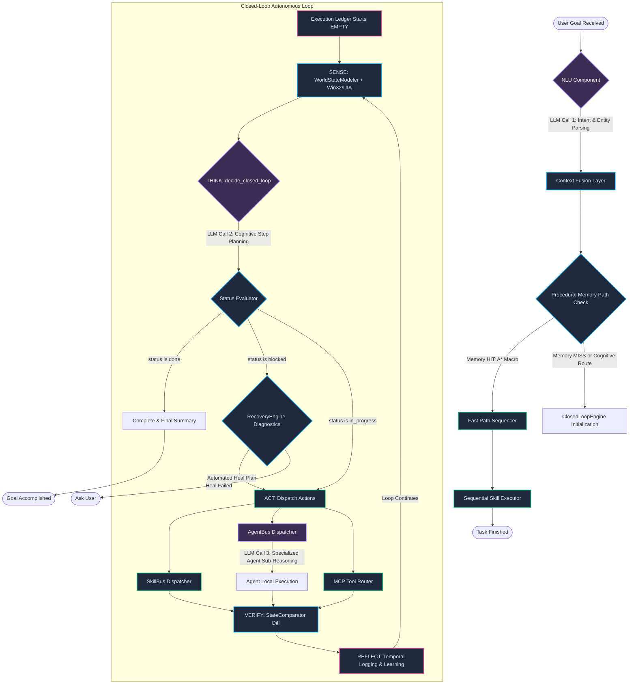

# Complete Architectural Blueprint: Autonomous Orchestration & Windows UI Automation in Jarvis v2

This document provides a highly technical, end-to-end architectural evaluation of the **Jarvis Control System**. It defines exactly when and where LLM layers, specialized agents, memory hierarchies, and system skills are invoked. Furthermore, it outlines how Jarvis interfaces natively with the Windows OS via **UI Automation (UIA)** and the **On-device Agent Registry (ODR)**, referencing the official technical specifications in [Building Windows MCP Integration.md](file:///F:/RunningProjects/JarvisControlSystem/referency/Building%20Windows%20MCP%20Integration.md).

---

## 1. The Autonomous Closed-Loop Cycle (Observe → Plan → Act → Verify → Reflect)

To achieve true autonomy and eliminate manual intervention or hardcoded timeouts, Jarvis operates in a strict, unmediated **closed-loop feedback cycle**. The loop is driven **entirely by the LLM's unified cognitive capability** via the [ClosedLoopEngine](file:///f:/RunningProjects/JarvisControlSystem/jarvis/brain/closed_loop_engine.py). 



---

## 2. In-Depth Allocation: Where and When LLMs & Tools are Invoked

To understand the coordination of intelligence and action, the table below maps the precise locations, roles, and structures of all LLM and execution components in the Jarvis Control System.

| Architectural Phase | Component Invoked | LLM Involvement | Input Context & Sources | Output Result & Next Step |
| :--- | :--- | :--- | :--- | :--- |
| **Perception & NLU** | `NLU.parse()` | **Yes (LLM Call 1)** | Raw text query, focused app id. | Structured intent, categorized intent tier (e.g., `EXECUTION`, `EDUCATIONAL`), and extracted entities. |
| **Context Fusion** | `ContextFusionLayer.fuse()` | No | NLU packet, Active window details, prior step state snapshot. | Unified context envelope containing coreference resolutions. |
| **Fast Path Check** | `ProceduralMemory.recall()` | No | Target goal, focused application ID, start state signature. | Returns `MemoryPath` (A* macro path of pre-learned skills) on hit. Bypasses cognitive loops. |
| **Dynamic SENSE** | `WorldStateModeler.get_current_state()` | No | Running background process tables, focused window coordinates. | Unified `WorldState` snapshot (focused HWND, process memory, active tab URL). |
| **Cognitive THINK** | `ClosedLoopEngine._think()` | **Yes (LLM Call 2)** | System prompt, Goal, empty/running `ExecutionLedger`, current `WorldState` diff, dynamic tool schemas (Skills, Agents, MCP). | A JSON `ClosedLoopDecision` containing `status` (`in_progress`/`done`/`blocked`), `reasoning`, and an array of actions. |
| **Skill Execution** | `SkillBus.dispatch()` | No | Target `SkillCall` with validated parameters (e.g., `open_app`, `type_text`). | `SkillResult` containing success status, raw stdout, and execution duration. |
| **Agent Delegation** | `AgentBus.run_single()` | **Yes (LLM Call 3 - Sub-Agent)** | Local task prompt, `AgentLocalMemory` scratchpad, `SharedAgentContext` graph logs. | `AgentResult` containing the sub-agent’s specialized reasoning trace and outputs. |
| **MCP Integration** | `MCPBus.call_tool()` | No | JSON-RPC requests bound to local stdio pipes or remote HTTP SSE streams. | Structured tool-specific data returned from native OS/Browser APIs. |
| **Verify & Compare** | `StateComparator.diff()` | No | Pre-execution `WorldState` vs. Post-execution `WorldState`. | Semantic difference report (e.g., *"Notepad launched, focus changed"*). |
| **Temporal Reflection**| `TemporalMemory.log_event()` | No | Skill execution status, execution durations, active process metadata. | Logs recorded to persistent SQLite database for procedural tracing. |
| **Self-Healing** | `RecoveryEngine.diagnose_and_heal()` | **Yes (LLM Call 4 - Option)** | Error string, failed skill signature, focused app ID. | Corrective execution plan (lightweight skill sequence to bypass/fix blocking state). |

---

## 3. Native Windows UI Automation (UIA) & On-Device Agent Registry (ODR)

Rather than using slow, error-prone visual parsing (Computer Vision/VLMs) that fails with changes to display resolution or system themes, Jarvis accesses the Windows operating system natively. It utilizes the **Windows Accessibility (a11y) Tree** to construct a deterministic, semantic DOM-like model of the desktop.

### Semantic UI Automation Mechanics
As specified in [Building Windows MCP Integration.md](file:///F:/RunningProjects/JarvisControlSystem/referency/Building%20Windows%20MCP%20Integration.md#L45), Jarvis integrates advanced UI automation layers:
*   **Accessibility Tree Interop**: Accesses the native `IUIAutomation` COM (Component Object Model) interfaces. It queries controls by their absolute programmatic **AutomationID**, **Control Type** (e.g., `Button`, `Edit`, `Document`), and **Name**, completely independent of physical screen coordinates or scaling.
*   **Browser DOM Mode**: For Microsoft Edge and Google Chrome, Jarvis bypasses outer window frames (like tabs or address bars) to interact directly with the web page. It accomplishes this by native extraction of the browser's `RootWebArea` element via UI Automation.
*   **IAccessible2 Fallback**: In browsers such as Mozilla Firefox that do not natively expose standard UIA structures, Jarvis falls back to the `IAccessible2` interface to guarantee consistent, cross-browser DOM node parsing and automation.

```
                  ┌──────────────────────────────────────────────┐
                  │                 Jarvis Agent                 │
                  └──────────────────────┬───────────────────────┘
                                         │
                                         ▼ (MCP JSON-RPC over stdio)
                  ┌──────────────────────────────────────────────┐
                  │           Windows MCP Server                 │
                  └──────────────────────┬───────────────────────┘
                                         │
                    ┌────────────────────┴────────────────────┐
                    ▼ (UIA COM Interop)                       ▼ (IAccessible2 Fallback)
        ┌───────────────────────┐                 ┌───────────────────────┐
        │   RootWebArea (UIA)   │                 │   IAccessible2 DOM    │
        │  (Chrome/Edge Native) │                 │   (Firefox Web Pages) │
        └───────────────────────┘                 └───────────────────────┘
```

### The Windows On-device Agent Registry (ODR)
To operationalize these capabilities safely, Jarvis interfaces with the official Microsoft **On-device Agent Registry (ODR)** via `odr.exe` ([Building Windows MCP Integration.md](file:///F:/RunningProjects/JarvisControlSystem/referency/Building%20Windows%20MCP%20Integration.md#L15)):
1.  **Server Discovery**: Jarvis host query commands scan the central Windows ODR via `odr.exe list` to discover registered system-level capabilities and MCP endpoints dynamically.
2.  **Lifecycle Management**: Developers register local or remote MCP connectors in the ODR system using:
    ```powershell
    odr.exe add --manifest C:\Path\To\server_manifest.mcpb
    ```
3.  **Containment Sessions**: By default, Windows instantiates registered servers inside an **Isolated Agent Session**. This boundary limits the agent's access to pre-approved system directories and protects the operating system against **Cross-Prompt Injection** attacks, preventing untrusted inputs from executing unauthorized shell calls on the host machine.

### Packaging, Sandboxing, and the MSIX Root of Trust
To transition from experimental settings to enterprise-grade sandboxed security, Jarvis MCP servers are containerized using the modern **MSIX Packaging format** ([Building Windows MCP Integration.md](file:///F:/RunningProjects/JarvisControlSystem/referency/Building%20Windows%20MCP%20Integration.md#L131)):
*   **The 5-Part Package Identity Tuple**: Identifies the server cryptographically to the Windows OS:
    $$\text{Identity} = \langle \text{Name}, \text{Version}, \text{Architecture}, \text{ResourceId}, \text{Publisher} \rangle$$
    This tuple is used by Windows to generate a secure **Package Family Name** to scope file-system access and security policies.
*   **Registry & File Virtualization**: The MSIX container intercepts all state-altering changes. If the server tries to write to the global registry or system folders, modern Windows redirects these writes to a virtualized overlay. This ensures a 100% clean, residual-free uninstallation.
*   **AppxBlockMap Differential Deployments**: Uses SHA-256 block mapping of the application binary in $64\text{ KB}$ segments. When updating Jarvis tool systems in a corporate fleet, Windows updates only the changed $64\text{ KB}$ blocks, drastically reducing bandwidth and deployment overhead.

---

## 4. The Native Option: Implementing Windows MCP Servers in C / C++

For maximum speed, absolute minimal memory footprints, and raw hardware access, implementing the Windows MCP and Shell Automation server in **native C or C++** is a premier architectural choice. This completely bypasses the .NET Common Language Runtime (CLR) or Python interpreters, resulting in a zero-dependency compiled binary.

### Low-Level UIA & Shell Automation via C++
C++ excels in direct Windows OS programming by eliminating wrapping layers:
*   **Native COM Interop**: Instead of relying on intermediate Interop assemblies, a C++ MCP server compiles directly against native system headers (`Windows.h`, `UIAutomation.h`, and `Objbase.h`). This delivers microseconds-level latency when traversing the Windows accessibility tree.
*   **Modern C++/WinRT & WIL**: Modern C++ projects leverage **C++/WinRT** (Microsoft's standard language projection for Windows Runtime APIs) and the **Windows Implementation Library (WIL)**. This provides automated, exception-safe RAII wrappers (like `wil::com_ptr`) to eliminate traditional COM reference counting leaks (`AddRef`/`Release`).
*   **Shell Integration**: C++ has direct native access to high-impact shell libraries (e.g., `Shellapi.h` and `Shlobj.h`). Starting background tasks, resolving system shortcuts, and monitoring file directories via `ReadDirectoryChangesW` are executed natively with zero VM overhead.

### Code Pattern: Native C++ UIA Control Identification
The following C++ snippet demonstrates how a C++ Windows MCP server locates a specific UI control (such as a text box or button) semantically using native COM interfaces:

```cpp
#include <windows.h>
#include <uiautomation.h>
#include <wil/com.h>
#include <iostream>

// Helper to find a UI element by AutomationID semantically
wil::com_ptr<IUIAutomationElement> FindElementByAutomationId(
    IUIAutomation* pAutomation, 
    IUIAutomationElement* pRoot, 
    const wchar_t* automationId) 
{
    wil::com_ptr<IUIAutomationCondition> pCondition;
    VARIANT varId;
    VariantInit(&varId);
    varId.vt = VT_BSTR;
    varId.bstrVal = SysAllocString(automationId);

    // Create condition: find control matching the specific AutomationId
    HRESULT hr = pAutomation->CreatePropertyCondition(
        UIA_AutomationIdPropertyId, 
        varId, 
        &pCondition
    );
    
    wil::com_ptr<IUIAutomationElement> pFoundElement;
    if (SUCCEEDED(hr) && pCondition) {
        // Query child elements recursively matching condition
        pRoot->FindFirst(TreeScope_Descendants, pCondition.get(), &pFoundElement);
    }
    
    VariantClear(&varId);
    return pFoundElement;
}
```

### Strategic Tradeoffs: Python vs. C# (.NET) vs. C/C++
When selecting a programming language to extend the Jarvis Control System's Windows MCP and shell layer, review the following performance profiles:

| Dimension | Python | C# (.NET 9.0) | C / C++ Native |
| :--- | :--- | :--- | :--- |
| **Execution Latency** | High ($200\text{ ms} - 500\text{ ms}$) | Low ($5\text{ ms} - 20\text{ ms}$ via AOT) | Ultra-Low ($< 1\text{ ms}$ direct machine code) |
| **Memory Footprint** | Heavy ($80\text{ MB} - 150\text{ MB}$) | Medium ($20\text{ MB} - 50\text{ MB}$ via AOT) | Microscopic ($2\text{ MB} - 8\text{ MB}$) |
| **Runtime Dependency** | Python Interpreter + pip packages | .NET Runtime (or zero via standalone AOT) | None (Single static `.exe` binary) |
| **COM / Win32 Interop** | Slow ctypes or pywin32 wrappers | Good (Built-in runtime marshaling) | Perfect (Native compilation, zero marshaling) |
| **Development Speed** | Extremely Fast (Dynamic typing) | Fast (Attribute-based tool mapping) | Moderate (Manual schema definition, strict memory management) |
| **Containment Compatibility** | Moderate (Requires bundling Python in MSIX) | Perfect (MSIX container native support) | Perfect (Seamless static MSIX packaging) |

---

## 5. Sub-Agent Coordination & Communication Protocols

For specialized agents (Coding, Desktop, Browser, Memory) to cooperate smoothly without hardcoded sequences, Jarvis uses the following protocols:

### 1. Centralized Task Orchestration (TaskGraph)
When the user submits a complex request, the main orchestrator doesn't execute a flat sequence. It constructs a directed acyclic graph (DAG) of [AgentTasks](file:///f:/RunningProjects/JarvisControlSystem/jarvis/agents/task_graph.py#L16).
*   **Topological Execution Stages**: The orchestrator invokes [TaskGraph.get_execution_stages()](file:///f:/RunningProjects/JarvisControlSystem/jarvis/agents/task_graph.py#L72) which applies Kahn's algorithm to resolve dependencies and group independent tasks into sequential levels:
    *   *Stage 1 (Parallel execution)*: Task A (Browser Agent: Research ROS2 CLI endpoints) & Task B (File System Agent: Read local configuration) run concurrently using the `AgentBus.run_parallel()` thread pool.
    *   *Stage 2 (Sequential block)*: Task C (Coding Agent: Synthesize custom code template) executes, consuming Stage 1 outputs.

### 2. Isolated Agent Memory (`AgentLocalMemory`)
To keep sub-agent prompts highly focused and token-efficient, each sub-agent is spawned with an isolated `AgentLocalMemory` instance.
*   **Scratchpad Boundary**: All intermediary reasoning steps, local shell executions, and sub-tool parameters are logged locally to the agent's scratchpad.
*   This prevents other concurrent agents' logs from polluting the local execution context, keeping token footprints minimal.

### 3. Unified State Sharing (`SharedAgentContext`)
While local actions are isolated, overall context is shared. The [SharedAgentContext](file:///f:/RunningProjects/JarvisControlSystem/jarvis/agents/agent_interface.py#L12) enables safe communication:
*   **Cross-Agent Results Transit**: The `AgentBus` enriches the execution context passed to downstream agents via a shared results register (`__pipeline_results__`).
*   **Episodic Global Log**: Successful completions write descriptive observations to the central memory database (e.g., `shared.observe("Agent Browser-Research completed successfully. Found ROS2 CLI tools.")`).

---

## 6. End-to-End Orchestrated Flow: Edge-GitHub-Notepad Case Study

To see this exact architecture in action, let's trace the detailed flow of a user requesting: *"Search for ROS2 on GitHub, write a python example in Notepad."*

```
[User Request] ──► NLU (LLM Call 1: Extract goal) ──► ClosedLoopEngine Init
                                                              │
                                                     (Observe: State captured)
                                                              │
                                                     [THINK] ◄┴──────────────────────────────┐
                                                              │                              │
                                                   (LLM Call 2: Decide next step)            │
                                                              │                              │
                                                     [ACT: Dispatch Actions]                 │
                                                              │                              │
                         ┌────────────────────────────────────┼──────────────────────────┐   │
                         ▼ (Tool: open_app)                   ▼ (Tool: call_mcp_tool)    │   │
                  Launch Edge & Notepad                Queries GitHub ROS2 repos         │   │
                         │                                    │                          │   │
                         └──────────────────┬─────────────────┘                          │   │
                                            ▼                                            │   │
                                    [VERIFY & COMPARE]                                   │   │
                             (Compute WorldState delta)                                  │   │
                                            │                                            │   │
                                            ▼ (Success / Focus Notepad)                  │   │
                                         [THINK]                                         │   │
                              (LLM Call 2: Generate summary)                             │   │
                                            │                                            │   │
                                            ▼                                            │   │
                                    [ACT: type_text] ────────────────────────────────────┘   │
                                (Native keyboard input)                                      │
                                            │                                                │
                                            ▼ (Verify complete)                              │
                                        [REFLECT]                                            │
                             (Temporal Log & Macro Saved) ───────────────────────────────────┘
```

1.  **Cognitive Parsing**:
    *   The `NLU` parses user text via **LLM Call 1**, identifying intents (`web_search`, `content_generation`, `app_interaction`) and entities.
2.  **ClosedLoopEngine Initialization**:
    *   An empty `ExecutionLedger` is instantiated.
    *   `WorldStateModeler` queries the host OS via Win32. Detects Edge and Notepad are closed.
3.  **Iteration 1 (Setup Environment)**:
    *   **LLM Call 2** evaluates the initial state and decides to prepare the workspace.
    *   **ACT**: Dispatches two parallel `SkillCalls`: `open_app("Edge")` and `open_app("notepad")`.
    *   **VERIFY**: `StateComparator` runs, measuring new window handles. Focus shifts to Notepad.
4.  **Iteration 2 (Knowledge Acquisition)**:
    *   **LLM Call 2** sees environment is ready. Selects `call_mcp_tool` targeting a registered Web Browser/Search MCP server.
    *   **ACT**: The MCP server uses **Windows UIA** to extract the DOM/RootWebArea of Edge, executes a search on GitHub for "ros2 python tutorial", and fetches the contents of a popular repository.
    *   **VERIFY**: Captured DOM contains raw code blocks.
5.  **Iteration 3 (Task Execution & Delivery)**:
    *   **LLM Call 2** consumes the raw code blocks from the `ExecutionLedger`. It synthesizes the final python example.
    *   **ACT**: Dispatches `type_text` to type the code into Notepad.
    *   **VERIFY**: The system first verifies that Notepad is the active foreground window via `WorldStateModeler.get_current_state().active_window`. It then sends the keyboard inputs.
6.  **Iteration 4 (Reflection & Completion)**:
    *   `WorldStateModeler` confirms the text is successfully written to the Notepad editor UI.
    *   **LLM Call 2** sees all tasks completed and yields `status: "done"`.
    *   **REFLECT**: `TemporalMemory` logs performance metrics, and the `ReactiveLearner` registers a state-aware Macro, enabling the system to execute the same sequence in the future via a fast path, bypassing cognitive LLM steps entirely.
