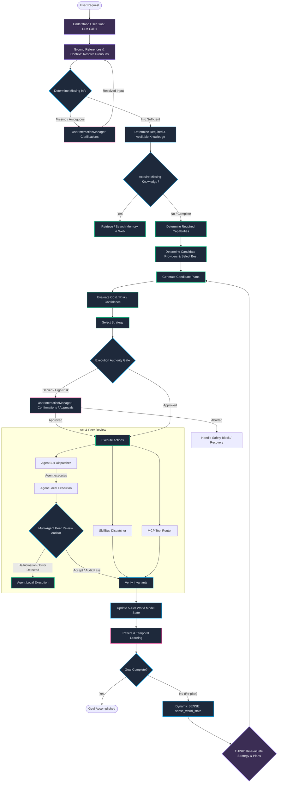

# Complete Architectural Blueprint: Autonomous Orchestration & Windows UI Automation in Jarvis v2

This document provides a highly technical, end-to-end architectural evaluation of the **Jarvis Control System**. It defines exactly when and where LLM layers, specialized agents, memory hierarchies, and system skills are invoked. Furthermore, it outlines how Jarvis interfaces natively with the Windows OS via **UI Automation (UIA)** and the **On-device Agent Registry (ODR)**, referencing the official technical specifications in [Building Windows MCP Integration.md](file:///F:/RunningProjects/JarvisControlSystem/referency/Building%20Windows%20MCP%20Integration.md).

---

## 1. The Autonomous Closed-Loop Cycle (Goal-Centric & Safety-First)

To achieve true autonomy, Jarvis is designed around an advanced **Goal-Centric, Safety-First Cognitive Loop** that treats tools strictly as dynamic resources to achieve a user goal, rather than as primary mechanisms. The loop decouples the cognitive parsing, reference grounding, knowledge gathering, abstract capability planning, multi-agent validation, safety auditing, execution, and meta-cognition phases into a resilient, five-tier world-state-backed closed loop.



---

## 2. In-Depth Allocation: Where and When LLMs & Tools are Invoked

To understand the coordination of intelligence and action, the table below maps the precise locations, roles, and structures of all LLM and execution components in the Jarvis Control System.

| Architectural Phase | Component Invoked | LLM Involvement | Input Context & Sources | Output Result & Next Step |
| :--- | :--- | :--- | :--- | :--- |
| **Understand Goal** | `GoalUnderstandingLayer.understand()` | **Yes (LLM Call 1)** | Raw text query, focused app id. | Structured Goal Model defining target end-state, intents, and user constraints. |
| **Ground References**| `GroundingLayer.ground()` | No / Optional | Goal Model, focused app active state, recent action/conversational history. | Cleaned Goal Model with resolved pronouns (e.g., "it", "again", "that one") and established spatial/temporal context anchors. |
| **Determine Missing Info**| `KnowledgeGapEngine.check()` | No / Optional | Grounded Goal Model, user context parameters. | Detects missing required parameters (dates, directories) or low confidence. Triggers `UserInteractionManager` clarification if gaps exist. |
| **Knowledge Assessment**| `ContextFusionLayer.fuse()` | No | Grounded Goal Model, active window details, semantic context. | Resolves required vs. available knowledge. Triggers dynamic memory or browser queries if knowledge gaps are found. |
| **Capability Planning**| `CapabilityPlanner.resolve_capabilities()` | No | Target Goal Model, context envelope. | Resolves abstract capabilities needed (e.g., `web_access`, `reading`, `summarization`) instead of tool binds. |
| **Provider Selection**| `CapabilityPlanner.select_providers()` | No | Capability requirements, active provider registry, provider dynamic health scores. | Binds capabilities to the best candidate providers (e.g., Browser Agent vs. local Brave scraper vs. MCP Search Tool). |
| **Plan Generation** | `ClosedLoopEngine.generate_plans()` | **Yes (LLM Call 2)** | System prompt, Goal Model, Execution Ledger, current `WorldState` diff, dynamic candidate plans. | Candidate execution strategies (action sequences) decoupled from final tool implementations. |
| **Cost & Risk Eval** | `ExecutionAuthority.evaluate_risk()` | No | Candidate plans, safety policies, dynamic cost-risk algorithms. | Computes costs, safety risk coefficients, and planning confidence values. |
| **Execution Authority**| `ExecutionAuthority.validate()` | No | Selected strategy (from THINK or Fast Path), safety policies, risk thresholds. | Gateway monitor. Approves, denies, or routes high-risk/aborted actions to `UserInteractionManager` for confirmations. |
| **Interactive Management**| `UserInteractionManager.prompt()` | No | Clarifications, confirmations, safety approval gates, dynamic structured choices. | Session-aware user responses returned to the routing loops (Grounding, Execution, Strategy). |
| **Skill Execution** | `SkillBus.dispatch()` | No | Target `SkillCall` bound dynamically by the capability registry with validated parameters. | `SkillResult` containing success status, raw stdout, and execution duration. |
| **Agent Delegation** | `AgentBus.run_single()` | **Yes (LLM Call 3 - Generator)** | Local task prompt, `AgentLocalMemory` scratchpad, `SharedAgentContext` graph logs. | Generates proposed artifacts (e.g. scripts) using decoupled `Agent -> Capability -> Tool` bindings. |
| **Multi-Agent Audit**  | `CodeReviewAgent.audit()` | **Yes (LLM Call 3 - Critic)** | Proposed agent artifacts, coding syntax conventions, safety policies. | Peer review confidence score. Loops back to generator if errors exist, otherwise accepts output. |
| **MCP Integration** | `MCPBus.call_tool()` | No | JSON-RPC requests bound to local stdio pipes or remote HTTP SSE streams. | Structured tool-specific data returned from native OS/Browser APIs. |
| **Verify Invariants** | `StateComparator.diff()` | No | Pre-execution `WorldState` vs. Post-execution `WorldState`. | Semantic difference report evaluating success invariants (e.g., process active, window focused). |
| **Update World Model**| `WorldStateModeler.update_state()` | No | Verified post-execution state change delta, knowledge extracts, and task state progress. | Explicitly updates the holistic **Five-Tier World Model** (Environment, UI, Knowledge, Task, Agent states). |
| **Temporal Reflection**| `TemporalMemory.log_event()` | No | Skill execution status, execution durations, active process metadata. | Logs recorded to persistent SQLite database for procedural tracing and macro template compilation. |
| **Self-Healing** | `RecoveryEngine.diagnose_and_heal()` | **Yes (LLM Call 4 - Option)** | Error string, failed skill signature, focused app ID. | Corrective execution plan (lightweight skill sequence to bypass/fix blocking state) routed to Execution Authority. |

---

## 3. Native Windows UI Automation (UIA) & On-Device Agent Registry (ODR)

Rather than using slow, error-prone visual parsing (Computer Vision/VLMs) that fails with changes to display resolution or system themes, Jarvis accesses the Windows operating system natively. It utilizes the **Windows Accessibility (a11y) Tree** to construct a deterministic, semantic DOM-like model of the desktop.

### Semantic UI Automation Mechanics
As specified in [Building Windows MCP Integration.md](file:///F:/RunningProjects/JarvisControlSystem/referency/Building%20Windows%20MCP%20Integration.md#L45), Jarvis integrates advanced UI automation layers:
*   **Accessibility Tree Interop**: Accesses the native `IUIAutomation` COM (Component Object Model) interfaces. It queries controls by their absolute programmatic **AutomationID**, **Control Type** (e.g., `Button`, `Edit`, `Document`), and **Name**, completely independent of physical screen coordinates or scaling.
*   **Browser DOM Mode**: For Microsoft Edge and Google Chrome, Jarvis bypasses outer window frames (like tabs or address bars) to interact directly with the web page. It accomplishes this by native extraction of the browser's `RootWebArea` element via UI Automation.
*   **IAccessible2 Fallback**: In browsers such as Mozilla Firefox that do not natively expose standard UIA structures, Jarvis falls back to the `IAccessible2` interface to guarantee consistent, cross-browser DOM node parsing and automation.

```
                  ┌──────────────────────────────────────────────┐
                  │                 Jarvis Agent                 │
                  └──────────────────────┬───────────────────────┘
                                         │
                                         ▼ (MCP JSON-RPC over stdio)
                  ┌──────────────────────────────────────────────┐
                  │           Windows MCP Server                 │
                  └──────────────────────┬───────────────────────┘
                                         │
                    ┌────────────────────┴────────────────────┐
                    ▼ (UIA COM Interop)                       ▼ (IAccessible2 Fallback)
        ┌───────────────────────┐                 ┌───────────────────────┐
        │   RootWebArea (UIA)   │                 │   IAccessible2 DOM    │
        │  (Chrome/Edge Native) │                 │   (Firefox Web Pages) │
        └───────────────────────┘                 └───────────────────────┘
```

### The Windows On-device Agent Registry (ODR)
To operationalize these capabilities safely, Jarvis interfaces with the official Microsoft **On-device Agent Registry (ODR)** via `odr.exe` ([Building Windows MCP Integration.md](file:///F:/RunningProjects/JarvisControlSystem/referency/Building%20Windows%20MCP%20Integration.md#L15)):
1.  **Server Discovery**: Jarvis host query commands scan the central Windows ODR via `odr.exe list` to discover registered system-level capabilities and MCP endpoints dynamically.
2.  **Lifecycle Management**: Developers register local or remote MCP connectors in the ODR system using:
    ```powershell
    odr.exe add --manifest C:\Path\To\server_manifest.mcpb
    ```
3.  **Containment Sessions**: By default, Windows instantiates registered servers inside an **Isolated Agent Session**. This boundary limits the agent's access to pre-approved system directories and protects the operating system against **Cross-Prompt Injection** attacks, preventing untrusted inputs from executing unauthorized shell calls on the host machine.

### Packaging, Sandboxing, and the MSIX Root of Trust
To transition from experimental settings to enterprise-grade sandboxed security, Jarvis MCP servers are containerized using the modern **MSIX Packaging format** ([Building Windows MCP Integration.md](file:///F:/RunningProjects/JarvisControlSystem/referency/Building%20Windows%20MCP%20Integration.md#L131)):
*   **The 5-Part Package Identity Tuple**: Identifies the server cryptographically to the Windows OS:
    $$\text{Identity} = \langle \text{Name}, \text{Version}, \text{Architecture}, \text{ResourceId}, \text{Publisher} \rangle$$
    This tuple is used by Windows to generate a secure **Package Family Name** to scope file-system access and security policies.
*   **Registry & File Virtualization**: The MSIX container intercepts all state-altering changes. If the server tries to write to the global registry or system folders, modern Windows redirects these writes to a virtualized overlay. This ensures a 100% clean, residual-free uninstallation.
*   **AppxBlockMap Differential Deployments**: Uses SHA-256 block mapping of the application binary in $64\text{ KB}$ segments. When updating Jarvis tool systems in a corporate fleet, Windows updates only the changed $64\text{ KB}$ blocks, drastically reducing bandwidth and deployment overhead.

---

## 4. The Native Option: Implementing Windows MCP Servers in C / C++

For maximum speed, absolute minimal memory footprints, and raw hardware access, implementing the Windows MCP and Shell Automation server in **native C or C++** is a premier architectural choice. This completely bypasses the .NET Common Language Runtime (CLR) or Python interpreters, resulting in a zero-dependency compiled binary.

### Native Project Structure
To establish a clean, production-grade project structure, the entire C++ UI Automation pipeline and its underlying projects are maintained natively under the `native/` directory:
*   **[Microsoft-UI-UIAutomation](file:///f:/RunningProjects/JarvisControlSystem/native/Microsoft-UI-UIAutomation)**: The complete, native UI Automation repository, preserving full Git history, Azure pipelines, and build scripts for long-term compatibility and upstream upgrades.
*   **[UIAutomation.sln](file:///f:/RunningProjects/JarvisControlSystem/native/Microsoft-UI-UIAutomation/src/UIAutomation/UIAutomation.sln)**: The central Visual Studio solution containing the native UI Automation project pipeline under `src/UIAutomation/`.
*   **[UiaOperationAbstraction](file:///f:/RunningProjects/JarvisControlSystem/native/Microsoft-UI-UIAutomation/src/UIAutomation/UiaOperationAbstraction)**: A static C++ library that wraps raw Windows UI Automation, providing a dual-mode interface that seamlessly switches between classic COM and high-performance Remote Operations.
*   **[Microsoft.UI.UIAutomation](file:///f:/RunningProjects/JarvisControlSystem/native/Microsoft-UI-UIAutomation/src/UIAutomation/Microsoft.UI.UIAutomation)**: The native DLL project implementing the WinRT projection mapping and Core Remote Operations serialization pipeline.

### Low-Level UIA & Shell Automation via C++
C++ excels in direct Windows OS programming by eliminating wrapping layers:
*   **Native COM Interop**: Instead of relying on intermediate Interop assemblies, a C++ MCP server compiles directly against native system headers (`Windows.h`, `UIAutomation.h`, and `Objbase.h`). This delivers microseconds-level latency when traversing the Windows accessibility tree.
*   **Modern C++/WinRT & WIL**: Modern C++ projects leverage **C++/WinRT** (Microsoft's standard language projection for Windows Runtime APIs) and the **Windows Implementation Library (WIL)**. This provides automated, exception-safe RAII wrappers (like `wil::com_ptr`) to eliminate traditional COM reference counting leaks (`AddRef`/`Release`).
*   **Shell Integration**: C++ has direct native access to high-impact shell libraries (e.g., `Shellapi.h` and `Shlobj.h`). Starting background tasks, resolving system shortcuts, and monitoring file directories via `ReadDirectoryChangesW` are executed natively with zero VM overhead.

### UIA Remote Operations (High-Performance $O(1)$ IPC Execution)
In traditional automation, traversing the accessibility tree forces an explosion of cross-process COM calls. For example, finding a specific child text element, retrieving its bounding box, checking its text value, and walking its parent chain triggers dozens of individual IPC calls. At a standard system latency of $5\text{ ms} - 20\text{ ms}$ per RPC call, this can take $100\text{ ms} - 500\text{ ms}$, rendering real-time UI synchronization impossible.

To eliminate this latency bottleneck, Jarvis implements the **UIAutomation Remote Operations** paradigm:
1.  **Direct Execution Graph**: The client-side C++ builder maps out the automation steps as a single directed graph of operations (bytecode instructions).
2.  **Single IPC Round-Trip**: The compiled bytecode is sent in **exactly one** COM call to be evaluated *directly inside the target application's process context* on the OS side.
3.  **Local Execution Speed**: All element lookups, property checks, and loops occur locally at microseconds speed, returning only the requested final results. This reduces total IPC execution latency from hundreds of milliseconds to **$< 1\text{ ms}$ (a $500\times$ speedup)**.

```
[Classic COM UIA]
Jarvis MCP Server  ────── (IPC Call 1: Get Child) ───────► Target Process
Jarvis MCP Server  ◄───── (IPC Resp 1: Element) ───────── Target Process
Jarvis MCP Server  ────── (IPC Call 2: Read Name) ───────► Target Process
Jarvis MCP Server  ◄───── (IPC Resp 2: "Display") ─────── Target Process
  *Result: O(N) IPC calls - Slow (100ms - 500ms total)*

[UIA Remote Operations]
Jarvis MCP Server  ── (IPC Call: Bytecode Exec Graph) ──► Target Process (Local Exec Loop)
Jarvis MCP Server  ◄─ (IPC Resp: Combined Results) ───── Target Process
  *Result: O(1) IPC call - Microseconds (<1ms total)*
```

### The C++ Dual-Mode Wrapper Abstraction
Through the static wrapper library **`UiaOperationAbstraction`**, Jarvis can switch between "classic" COM UIA and "Remote Operations" dynamically via a boolean flag. 

To hide Remote Operations bytecode serialization complexity, the abstraction provides:
*   **Scope Management**: `UiaOperationScope::StartNew()` acts as a thread-local/fiber-local context. When Remote Operations is enabled, any calls made on UIA wrapper objects are accumulated as bytecode inside the scope's delegator.
*   **Unified Type Wrappers**: `UiaElement`, `UiaBool`, `UiaInt`, `UiaString`, `UiaArray`, `UiaRect` wrap standard UIA types. They act as local COM elements under classic mode, and as remote bytecode operands under Remote Operations mode.
*   **Remote Loops and Conditions**: Standard C++ conditions evaluate only once on the client. To bypass this, the wrapper provides control-flow mappings:
    *   `scope.If(UiaBool, OnTrue, OnFalse)`: Translated into a remote bytecode `If` branch.
    *   `scope.While(ConditionLambda, BodyLambda)`: Serialized as a remote bytecode `While` block, running the loop locally within the target app until the condition evaluates to false, without returning execution control to the client.
*   **Result Binding**: Wrapper variables are declared locally. Passing them to `scope.BindResult(var)` schedules them to be populated once the bytecode executes. Invoking `scope.Resolve()` dispatches the batch and marshals all output values back into standard local C++ types.

### Code Pattern: Native C++ UIA Remote Operations Traversal
The following self-contained C++ pattern demonstrates how to use the `UiaOperationAbstraction` library to batch-traverse the Windows UI element tree, utilize a remote loop, populate a cache request, and extract element properties in a single IPC call:

```cpp
#include <windows.h>
#include <uiautomation.h>
#include <wil/com.h>
#include <wil/resource.h>
#include <iostream>
#include <vector>
#include "UiaOperationAbstraction.h"

using namespace UiaOperationAbstraction;

// Executes a single-roundtrip search to retrieve a child element's cached properties
bool GetChildElementCachedProperties(
    IUIAutomation* pRawAutomation,
    IUIAutomationElement* pStartElement,
    const wchar_t* targetAutomationId,
    std::wstring& outElementName,
    CONTROLTYPEID& outControlType)
{
    // 1. Initialize the dual-mode UIA operation abstraction layer.
    // Set to 'true' to execute as a single microsecond-level Remote Operation.
    constexpr bool useRemoteOperations = true;
    UiaOperationAbstraction::Initialize(useRemoteOperations, pRawAutomation);
    auto cleanup = wil::scope_exit([]() { UiaOperationAbstraction::Cleanup(); });

    // 2. Open a thread-local/fiber-local Remote Operation Scope
    auto scope = UiaOperationScope::StartNew();

    // 3. Import the starting element as a remote operand
    UiaElement element = pStartElement;
    scope.BindInput(element);

    // 4. Configure a Remote Cache Request to retrieve Name and ControlType
    UiaCacheRequest cacheRequest;
    cacheRequest.AddProperty(UIA_NamePropertyId);
    cacheRequest.AddProperty(UIA_ControlTypePropertyId);

    // 5. Build the Remote Control Flow Graph
    UiaElement foundElement = nullptr;
    UiaElement currentChild = element.GetFirstChildElement();

    // Execute the loop entirely on the remote target process side
    scope.While(
        [&]() {
            // Loop condition: continue while currentChild is not Null and target is not found
            return !currentChild.IsNull() && foundElement.IsNull();
        },
        [&]() {
            // Loop Body: Check if the current element matches the target AutomationId
            UiaString currentIdVal = currentChild.GetPropertyValue(UiaPropertyId(UIA_AutomationIdPropertyId)).AsString();
            
            UiaBool isMatch = (currentIdVal == UiaString(targetAutomationId));
            
            scope.If(isMatch, 
                [&]() {
                    // Match found: Populate the cache request and assign found element
                    foundElement = currentChild.GetUpdatedCacheElement(cacheRequest);
                },
                [&]() {
                    // Match not found: Move to the next sibling element
                    currentChild = currentChild.GetNextSiblingElement();
                }
            );
        }
    );

    // 6. Bind outputs. They will be populated locally once scope is resolved.
    UiaString remoteName = foundElement.GetName(true /* useCachedApi */);
    UiaInt remoteControlType = foundElement.GetControlType();

    scope.BindResult(remoteName);
    scope.BindResult(remoteControlType);

    // 7. Dispatch the entire graph in EXACTLY 1 IPC call to the target application context
    HRESULT hr = scope.ResolveHr();
    if (FAILED(hr) || foundElement.IsNull()) {
        return false;
    }

    // 8. Safely extract results into native C++ local types
    outElementName = static_cast<wil::shared_bstr>(remoteName).get();
    outControlType = static_cast<int>(remoteControlType);
    return true;
}
```

### Strategic Tradeoffs: Python vs. C# (.NET) vs. C/C++
When selecting a programming language to extend the Jarvis Control System's Windows MCP and shell layer, review the following performance profiles:

| Dimension | Python | C# (.NET 9.0) | C / C++ Native |
| :--- | :--- | :--- | :--- |
| **Execution Latency** | High ($200\text{ ms} - 500\text{ ms}$) | Low ($5\text{ ms} - 20\text{ ms}$ via AOT) | Ultra-Low ($< 1\text{ ms}$ direct machine code) |
| **Memory Footprint** | Heavy ($80\text{ MB} - 150\text{ MB}$) | Medium ($20\text{ MB} - 50\text{ MB}$ via AOT) | Microscopic ($2\text{ MB} - 8\text{ MB}$) |
| **Runtime Dependency** | Python Interpreter + pip packages | .NET Runtime (or zero via standalone AOT) | None (Single static `.exe` binary) |
| **COM / Win32 Interop** | Slow ctypes or pywin32 wrappers | Good (Built-in runtime marshaling) | Perfect (Native compilation, zero marshaling) |
| **Development Speed** | Extremely Fast (Dynamic typing) | Fast (Attribute-based tool mapping) | Moderate (Manual schema definition, strict memory management) |
| **Containment Compatibility** | Moderate (Requires bundling Python in MSIX) | Perfect (MSIX container native support) | Perfect (Seamless static MSIX packaging) |
| **Tree Traversal Speed** | Unusable for complex trees | Moderate (High marshaling cost) | Instantaneous (Remote Operations batching) |

---

## 5. Sub-Agent Coordination, Peer Review, & Communication Protocols

For specialized agents (Coding, Desktop, Browser, Memory) to cooperate smoothly without hardcoded sequences, Jarvis uses the following protocols:

### 1. Centralized Task Orchestration (TaskGraph)
When the user submits a complex request, the main orchestrator doesn't execute a flat sequence. It constructs a directed acyclic graph (DAG) of [AgentTasks](file:///f:/RunningProjects/JarvisControlSystem/jarvis/agents/task_graph.py#L16).
*   **Topological Execution Stages**: The orchestrator invokes [TaskGraph.get_execution_stages()](file:///f:/RunningProjects/JarvisControlSystem/jarvis/agents/task_graph.py#L72) which applies Kahn's algorithm to resolve dependencies and group independent tasks into sequential levels:
    *   *Stage 1 (Parallel execution)*: Task A (Browser Agent: Research ROS2 CLI endpoints) & Task B (File System Agent: Read local configuration) run concurrently using the `AgentBus.run_parallel()` thread pool.
    *   *Stage 2 (Sequential block)*: Task C (Coding Agent: Synthesize custom code template) executes, consuming Stage 1 outputs.

### 2. Isolated Agent Memory (`AgentLocalMemory`)
To keep sub-agent prompts highly focused and token-efficient, each sub-agent is spawned with an isolated `AgentLocalMemory` instance.
*   **Scratchpad Boundary**: All intermediary reasoning steps, local shell executions, and sub-tool parameters are logged locally to the agent's scratchpad.
*   This prevents other concurrent agents' logs from polluting the local execution context, keeping token footprints minimal.

### 3. Unified State Sharing (`SharedAgentContext`)
While local actions are isolated, overall context is shared. The [SharedAgentContext](file:///f:/RunningProjects/JarvisControlSystem/jarvis/agents/agent_interface.py#L12) enables safe communication:
*   **Cross-Agent Results Transit**: The `AgentBus` enriches the execution context passed to downstream agents via a shared results register (`__pipeline_results__`).
*   **Episodic Global Log**: Successful completions write descriptive observations to the central memory database (e.g., `shared.observe("Agent Browser-Research completed successfully. Found ROS2 CLI tools.")`).

### 4. Generator-Critic Framework & Multi-Agent Peer Review
To eliminate command hallucinations and synthesis errors, high-impact sub-agents are dynamically coupled in a **Generator-Critic feedback loop**:
*   *Generator Agent:* Synthesizes proposed artifacts (e.g., Coding Agent generating python scripts).
*   *Critic/Auditor Agent:* (e.g., Code Review Agent) Audits proposed artifacts via independent static analysis, policy validation, and syntax constraint parsing.
*   *Acceptance Gate:* The orchestrator only accepts outputs and passes them downstream once the Auditor Agent assigns a high-confidence passing rating.

---

## 6. The Multi-Layer Structured World Model & Interaction Manager

### Holistic Five-Tier World Model
To support long-running, resilient autonomy, the system maintains a structured **World Model** comprising five decoupled state layers:
1.  **Environment State:** Running OS background processes, directory trees, network sockets, active handles, and system configurations.
2.  **UI State:** Foreground window handles, programmatic UIA tree dumps, focused coordinates, and web page DOM subtrees.
3.  **Knowledge State:** Semantically indexed factual assets, browser research extracts, variables, memory retrievals, and cached search summaries.
4.  **Task State:** Active Task DAG schemas, execution stage checkpoints, running progress logs, and task dependencies.
5.  **Agent State:** Active sub-agent configurations, isolated local memory stacks, dynamic safety metrics, and provider health histories.

### The Session-Aware User Interaction Manager
The `UserInteractionManager` acts as the dedicated gatekeeper for all interactive communications between Jarvis and the user:
*   **Clarifications:** Prompting the user to resolve pre-flight or mid-flight knowledge gaps (e.g., missing hotel target dates).
*   **Confirmations:** Requesting explicit verification before executing high-impact, destructive operations (e.g., "Confirm deleting folder `X`?").
*   **Approval Requests:** Coordinating checklist interfaces for execution authority overrides.
*   **Decision Requests:** Providing rich, structured choices when multiple candidates exist (e.g., "Select which GitHub repository to clone").

---

## 7. End-to-End Orchestrated Flow: Edge-GitHub-Notepad Case Study

To see this exact architecture in action, let's trace the detailed flow of a user requesting: *"Search for ROS2 on GitHub, write a python example in Notepad."*

```
[User Request] ──► GoalUnderstanding (Extract Goal Model: LLM Call 1)
                            │
                            ▼
              [Ground References & Context]
             (Resolve pronouns, active app history)
                            │
                            ▼
              [Knowledge & Gap Assessment]
            (Verify sufficient info, query memory)
                            │
                            ▼
              [Determine Needed Capabilities]
              (Abstract: web_search, file_write)
                            │
                            ▼
               [Determine Candidate Providers]
               (Binds Browser Agent, Skills)
                            │
                            ▼
               [THINK: Generate Strategy]
               (ClosedLoopEngine: LLM Call 2)
                            │
                            ▼
              [Evaluate Cost / Risk / Safety]
               (Execution Authority Gate)
                            │
                    (Approved & Safe)
                            │
                            ▼
                 [ACT: Dispatch Actions]
              (Edge & Notepad launched via skills)
                            │
                            ▼
               [VERIFY: State Invariants]
               (Success verified via UIA)
                            │
                            ▼
               [Update Internal World Model]
               (Record Edge & Notepad active)
                            │
                            ▼
              [THINK: Strategy - Next Step]
              (ClosedLoopEngine: LLM Call 2)
                            │
                            ▼
                [Execution Authority Gate]
                            │
                    (Approved & Safe)
                            │
                            ▼
                 [ACT: type_text in Notepad]
              (Keystrokes input via Windows UIA)
                            │
                            ▼
               [VERIFY & Update World Model]
               (Confirm success, sync world state)
                            │
                            ▼
                 [REFLECT: Learn Macro]
             (Goal Complete? Yes → Safe Macro Saved)
```

1.  **Goal Formulation & Understanding**:
    *   The `GoalUnderstandingLayer` parses the user text via **LLM Call 1**, translating it into a structured Goal Model:
        *   *Primary Goal:* Retrieve ROS2 code example from GitHub and write a clean python script into Notepad.
        *   *Intents:* `web_search`, `content_generation`, `app_interaction`.
        *   *Constraints:* Avoid command-line executions; use native Notepad editing.
2.  **Reference Grounding & pronoun Resolution**:
    *   `GroundingLayer` evaluates active environment and conversational history. Resolves any implicit coreferences or pronouns (e.g., if user says "it" or "again", maps them to the previously active web browser tab or focused text document).
3.  **Knowledge & Gap Assessment**:
    *   `KnowledgeGapEngine` scans the grounded Goal Model. Confirms all parameters (GitHub topic, target text editor Notepad) are sufficient. No clarification questions are required.
    *   `ContextFusionLayer` resolves contextual requirements and merges current desktop state details into the active goal packet.
4.  **Capability Planning & Provider Selection**:
    *   The system determines the abstract capabilities required:
        *   `web_search` and `web_read` (for finding and reading the ROS2 repo).
        *   `text_edit` (for writing code).
    *   `CapabilityPlanner` checks the active provider registry and dynamic health scores, matching:
        *   `web_search` $\rightarrow$ Browser Agent (Provider).
        *   `text_edit` $\rightarrow$ Notepad Skill (Provider).
5.  **Plan Generation & Strategy Formulation**:
    *   **THINK**: **LLM Call 2** evaluates the initial state. Rather than focusing on tool selection, it creates a candidate plan strategy: *First, establish an environment with Edge and Notepad active.*
    *   **Cost & Risk Evaluation**: `ExecutionAuthority` computes costs, safety risks (SAFE tier), and plans confidence score.
6.  **Execution Authority Safety Gate**:
    *   Validates the proposed actions against system safety policies. Since launching Microsoft Edge and Notepad are categorized as **SAFE**, they are approved.
7.  **Action Dispatch (ACT)**:
    *   Dispatches two parallel `SkillCalls` matching the selected providers: `open_app("Edge")` and `open_app("notepad")`.
8.  **Verify & World Model Update**:
    *   `StateComparator` runs pre- vs. post-action verification. Focus shifts to Notepad.
    *   `WorldStateModeler.update_state()` explicitly updates the internal **World Model** to register that Edge and Notepad are now active, open processes on the desktop.
9.  **Iteration 2 (Knowledge Acquisition & Execution)**:
    *   **THINK**: **LLM Call 2** sees the updated World Model is ready. Formulates next strategy step: *Obtain the required ROS2 knowledge from GitHub.*
    *   **Execution Authority**: Evaluates call targeting the Web Browser capability. Approved.
    *   **ACT**: The Browser Agent (Provider) uses **Windows UIA** to interact with Edge, executes a search on GitHub for "ros2 python tutorial", and fetches the contents of a popular repository.
    *   **VERIFY & Update World Model**: Captured DOM contains raw python code blocks. World Model is updated to include the retrieved knowledge.
10. **Iteration 3 (Task Delivery & Safe Insertion)**:
    *   **THINK**: **LLM Call 2** consumes the raw code blocks from the World Model. Synthesizes the final python example. Strategy step: *Type the example into the active Notepad editor.*
    *   **Execution Authority**: Scans the text insertion payload to ensure no shell commands or escape characters are hidden inside the text. Action approved.
    *   **ACT**: Dispatches `type_text` to type the code into Notepad.
    *   **VERIFY & Update World Model**: The system verifies that Notepad is the active foreground window via `WorldStateModeler.get_current_state().active_window` and successfully inputs the keystrokes. World Model is updated to reflect the document's new text contents.
11. **Iteration 4 (Goal Verification, Reflection, & Re-planning Check)**:
    *   `WorldStateModeler` confirms the text is successfully written to the Notepad editor UI.
    *   `GoalCheck` evaluates the updated World Model state against the target Goal Model. State matches perfectly (Goal Complete? $\rightarrow$ **Yes**).
    *   **REFLECT**: `TemporalMemory` logs performance metrics. Because the end-state matched the Goal Model exactly and no safety or execution failures occurred, the `ReactiveLearner` safely registers a parameterized macro in procedural memory for fast path reuse, gated strictly by the Execution Authority.

---
