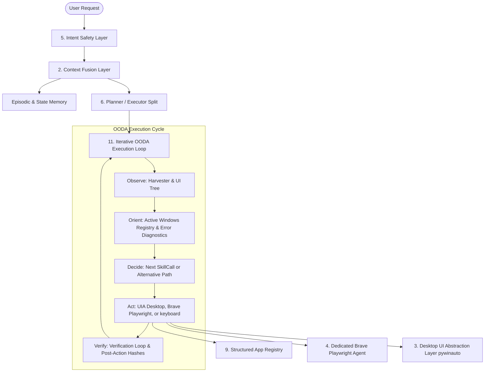

# Implementation Plan: Enhancing Jarvis with Robust Context, Playwright Browser Control, UIA Desktop Abstraction, and State-Driven Agentic Loops

This implementation plan addresses the architectural issues identified in [log_report1.md](file:///f:/RunningProjects/JarvisControlSystem/logs/log_fix_and%20tested/log_report1.md) and [telegram_chat.log](file:///f:/RunningProjects/JarvisControlSystem/logs/telegram_chat.log#L120-L189) while scaling Jarvis to support state-driven agentic OODA loops based on the [git-committer.md](file:///f:/RunningProjects/JarvisControlSystem/skill/git-committer.md) template.

---

## User Review Required

> [!IMPORTANT]
> **Key Architectural Migrations:**
> 1. **UIA Desktop Control:** Upgrading from mouse clicks on absolute coordinates (`pyautogui`) to native control actions via `pywinauto` + `uiautomation` to fix resolution dependencies and avoid PyAutoGUI fail-safe triggers.
> 2. **Dedicated Browser Agent:** Shifting Brave/browser control from generic window automation to dedicated Playwright + CDP automation, making it profile, tab, and DOM-aware.
> 3. **Iterative OODA Loop Integration:** Enhancing the Planner and Executor with a continuous Observe-Orient-Decide-Act (OODA) loop (inspired by the Git-Committer skill) that iteratively evaluates intermediate UI states and dynamically corrects errors until the user's high-level goal is verified.

> [!WARNING]
> Disabling the PyAutoGUI fail-safe is not recommended, but wrapping absolute coordinate mouse moves in safe bounds and shifting to native UIA window actions eliminates the accidental mouse corner drag trigger entirely.

---

## Open Questions

> [!NOTE]
> 1. **Brave Profile Selection:** For the Playwright integration, do you have a standard remote debugging port (e.g., `9222`) configured for Brave, or should Jarvis launch Brave dynamically with profile directory flags?
> 2. **State Harvester Settle Latency:** The current settle time is `600ms`. For web navigation or slower desktop applications, should we support dynamic settle time backing off up to `2.0 seconds` during verification failures?

---

## Proposed Changes

We will restructure the jarvis codebase across several architectural layers to incorporate these improvements.



### 1. Conversation State Manager & Window Focus Controller
We will build a centralized state tracker to maintain the runtime list of active windows, minimized states, and active application context.

#### [NEW] [state_manager.py](file:///f:/RunningProjects/JarvisControlSystem/jarvis/brain/state_manager.py)
* Create `ActiveApplication` and `WindowState` data structures tracking process IDs, window titles, handles (hwnd), and minimized status.
* Implement a `WindowManager` helper to fetch and parse open windows using `pywinauto.Desktop(backend="uia").windows()`.
* Implement a `focus_window(app_id)` function that:
  - Checks if the application already has active window handles in our registry.
  - Restores the window if minimized.
  - Sets focus/foreground on the existing window instead of launching a new process instance.

#### [MODIFY] [app_skill.py](file:///f:/RunningProjects/JarvisControlSystem/jarvis/skills/builtins/app_skill.py)
* Refactor `open_app` to integrate with `state_manager.py`.
* Before starting a new process via `os.startfile` or search, execute `focus_window(target)` to reuse existing instances if already running.

---

### 2. Context Fusion Layer
We will implement an advanced coreference and context blender to resolve pronoun-based instructions (e.g., "close it", "type in it", "switch back").

#### [NEW] [context_fusion.py](file:///f:/RunningProjects/JarvisControlSystem/jarvis/perception/context_fusion.py)
* Implement `ContextFusionLayer` which intercepts incoming packets:
  - Resolves pronouns (`it`, `them`, `that app`) using episodic history (the last focused app or window).
  - Merges active UI state snapshots, recent commands, and last actions to enrich the semantic payload before planning.
  - Updates intent understanding when a follow-up action is requested on the same window.

#### [MODIFY] [orchestrator.py](file:///f:/RunningProjects/JarvisControlSystem/jarvis/brain/orchestrator.py)
* Integrate `ContextFusionLayer` into the orchestrator pipeline, processing the parsed packet before passing it to the planner.

---

### 3. Desktop UI Abstraction Layer (pywinauto)
We will transition from absolute pixel-based mouse movements (`pyautogui`) to native accessibility element control clicks.

#### [MODIFY] [navigator_skill.py](file:///f:/RunningProjects/JarvisControlSystem/jarvis/skills/builtins/navigator_skill.py)
* Enhance `_click_by_accessibility(label)` to recursively search descendants of the active window for buttons, list items, links, or menu items whose titles match or partially match the requested label.
* Provide clean fallbacks so that if native clicking fails, it resorts to visual template matching before using raw mouse coordinates.

---

### 4. Dedicated Brave / Browser Agent
We will separate browser interactions into a DOM-aware browser automation interface, preventing Brave from being handled as a generic desktop window.

#### [NEW] [browser_skill.py](file:///f:/RunningProjects/JarvisControlSystem/jarvis/skills/builtins/browser_skill.py)
* Implement `open_browser_profile(profile_name)` and `switch_browser_tab(tab_title)`.
* Integrate Playwright / CDP connection to:
  - Inspect DOM nodes of active tabs.
  - Perform semantic browser clicks (e.g., click a button named "Log In", "Search").
  - Query tab URLs, active browser state, and page status.

#### [NEW] [brave_agent.py](file:///f:/RunningProjects/JarvisControlSystem/jarvis/agents/builtin/brave_agent.py)
* Create `BraveAgent` class (implementing `AgentInterface`) specialized in web navigation, search, and page interactions.
* Register `brave_agent` in `agent_bus.py`.

---

### 5. Intent Safety Layer
We will implement a protective layer to intercept informational questions and prevent accidental command execution.

#### [NEW] [safety_layer.py](file:///f:/RunningProjects/JarvisControlSystem/jarvis/brain/safety_layer.py)
* Implement `IntentSafetyLayer` classifier:
  - Detects if an utterance is educational, conversational, or a discussion (e.g., "How do I do X?", "What is a fail-safe?").
  - Sets a `safe_mode=True` flag on the `PerceptionPacket`.
  - Forces the planner to issue a friendly chat response (`chat_reply`) rather than executing active system commands.

---

### 6. Strict Planner / Executor Separation & Action Verification
We will enforce clean operational separation to eliminate JSON output leaks and false positives.

#### [MODIFY] [planner.py](file:///f:/RunningProjects/JarvisControlSystem/jarvis/brain/planner.py)
* Clean up system prompt to forbid planning leakages or raw JSON block outputs in chat responses.
* Enforce distinct modes: `Plan` (only raw executable steps) and `Chat` (only conversational text).

#### [MODIFY] [verification_loop.py](file:///f:/RunningProjects/JarvisControlSystem/jarvis/brain/verification_loop.py)
* Implement explicit verification methods:
  - `verify_window_exists(app_id)`: Checks UIA window listings.
  - `verify_focus(app_id)`: Checks foreground window hwnd matches target app.
  - `verify_navigation(target_node)`: Validates state hash transition or specific URL changes.

---

### 7. Iterative OODA Execution Loop & Agentic Scaling
We will scale the execution architecture of Jarvis to run on a continuous state-driven OODA loop (Observe-Orient-Decide-Act), allowing it to iteratively verify post-conditions and self-correct during failure modes.

#### [NEW] [ooda_runner.py](file:///f:/RunningProjects/JarvisControlSystem/jarvis/brain/ooda_runner.py)
* Implement `OODARunner` class which drives a continuous loop until a goal is fully completed:
  1. **Observe:** Capture UI snapshot, foreground active window title, and any active error logs.
  2. **Orient:** Check for PyAutoGUI fail-safe triggers, un-focused windows, or missing elements.
  3. **Decide:** Compare target goal with current state and synthesize the next logical corrective step (e.g., retry click, switch window, or ask user).
  4. **Act:** Dispatch selected action, wait for settle time, and re-enter loop.

---

## Verification Plan

### Automated Tests
* We will expand the existing `tests/unit` and `tests/integration` suites to verify all new components:
  ```powershell
  # Run new window state manager tests
  pytest tests/unit/test_state_manager.py
  # Run browser agent verification tests
  pytest tests/unit/test_brave_agent.py
  # Run entire smoke and integration test suite
  pytest tests/integration/test_pipeline_smoke.py
  ```

### Manual Verification
1. **App Reuse:** Launch notepad, type text. Open notepad again; verify it focuses the existing instance instead of launching a new window.
2. **Context Coreference:** Ask "open notepad", then ask "close it"; verify it closes notepad correctly.
3. **Intent Safety:** Ask "How do I open settings?"; verify it explains the action without actually opening settings.
4. **PyAutoGUI Fail-Safe Avoidance:** Perform clicks in a corner; verify they are safely intercepted or handled via native UIA clicks instead of mouse dragging.
